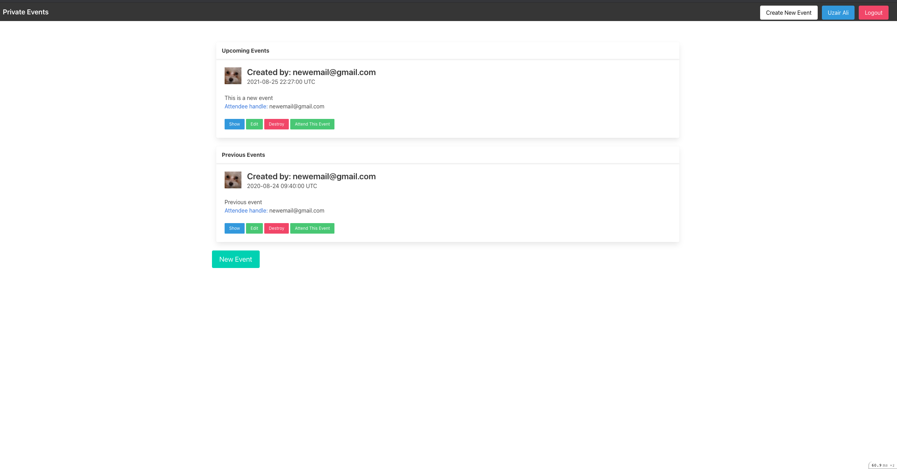

# Private Events

> This is an example of a CRUD app using rails. It is a private events posting app that works as a blog post but with user authentication system. So, rails tells the user if they are registered and can post or not. The main features of the app is that all the functions work dynamically using forms. A user is able to create, edit, delete or view a user. Since it is to test backend logic styling is not the main emphasis of this project. Please follow the steps to get your local copy and play around. Happy Coding!!!

## Built With

- Ruby
- Ruby On Rails

## Getting Started

To get a local copy up and running follow these simple example steps:

### Prerequisites

- Install [Ruby](https://www.ruby-lang.org/en/)
- Get [Rails](https://rubyonrails.org/)

### Setup

- To get a local copy of the project open terminal
- run `git clone https://github.com/uzairali19/members-only.git`
- Then run `cd members-only`

### Usage

- To use the app on local machine make sure you are on the root directory `private-events`
- Open terminal and run `bundle install` to install all the dependecies then run `rails db:migrate`
- Finally run `rails server` go to your browser and type `localhost:3000`
- Now you can play around with creating, updating or deleting users.

## Authors

👤 **Uzair Ali**

- GitHub: [@githubhandle](https://github.com/uzairali19)
- Twitter: [@twitterhandle](https://twitter.com/Uzairali751)
- LinkedIn: [LinkedIn](https://www.linkedin.com/in/uzairali19/)

## 🤝 Contributing

Contributions, issues, and feature requests are welcome!

Feel free to check the [issues page](https://github.com/uzairali19/private-events/issues/).

## Show your support

Give a ⭐️ if you like this project!

## 📝 License

This project is [MIT](./MIT.md) licensed. Please contact issues link for contributions.
